# T1A2 Portfolio

[GitHub Repo](https://github.com/JavanHaryanto/developer-portfolio)

# Description of portfolio website

## Purpose
The purpose of my developer portfolio is to help me form a strong online presence. Where potential clients and future employers can, learn more about me, view any previous work I have done and most importantly get in contact with me regarding any potential partnerships.  
 

## Functionality/Features
 

### Design
My portfolio is based on the idea that all the information regarding myself and my work is easy to find and understand. I have taken the minimalism approach, using a basic contrasting colour scheme, a maximum of 3 fonts and not adding elements or animations that don't serve a purpose.
 

### Call to Action
As mentioned previously, the purpose of the portfolio is to attract employers and potential new clients. Which is why I have included a "Call to Action" on all my pages, located above the footer and more importantly on the "landing page". This allows people to "Get in Touch" with me with ease.
 

### Services
I have included a services page, to allow my target audience to identify exactly what it is I have to offer and my strengths. I believe potential clients will view this as a way to see if I am someone they can work with and potentially hire.
 

### Social Media
In the footer of my portfolio, I have social icons and links to my main social accounts (Linkedin, Twitter, Facebook, Github). With the portfolio being more of a place to showcase my work, including links to my social media, enables my audience to get to know me on an even more personal level and take a closer look into how I interact with the community and how I contribute as a developer in the tech community.
 

### CV and Hire me
On the landing page and about me page, I have incorporated a button where people can download my resume easily.
Enabling my audience to quickly get a look into my past work and if I'm a good fit for what them.
 
 

## Sitemap
 

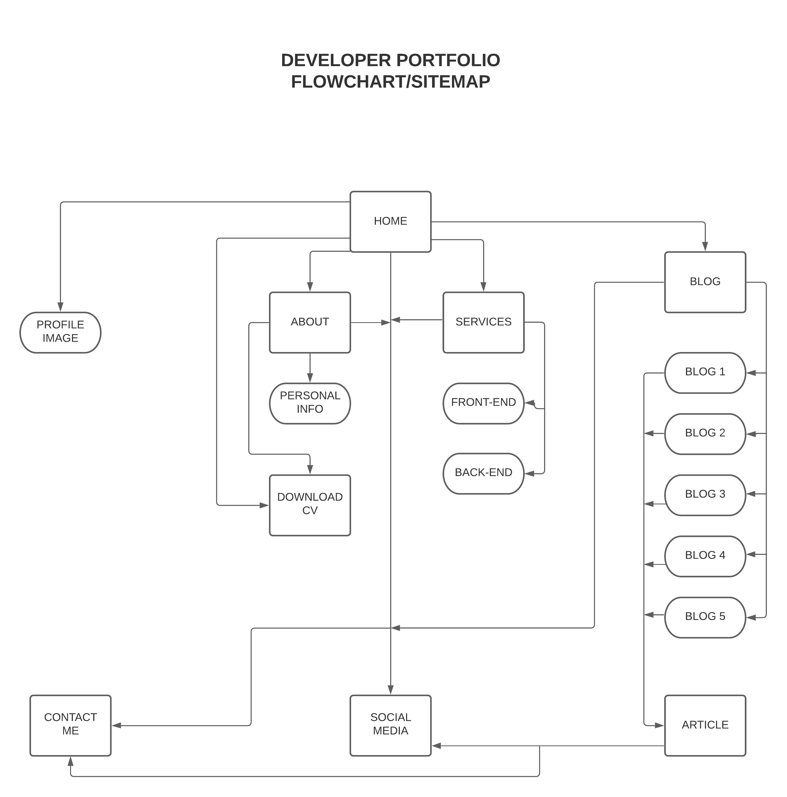
 
 
 

## Screenshots
### Desktop Mockups
 

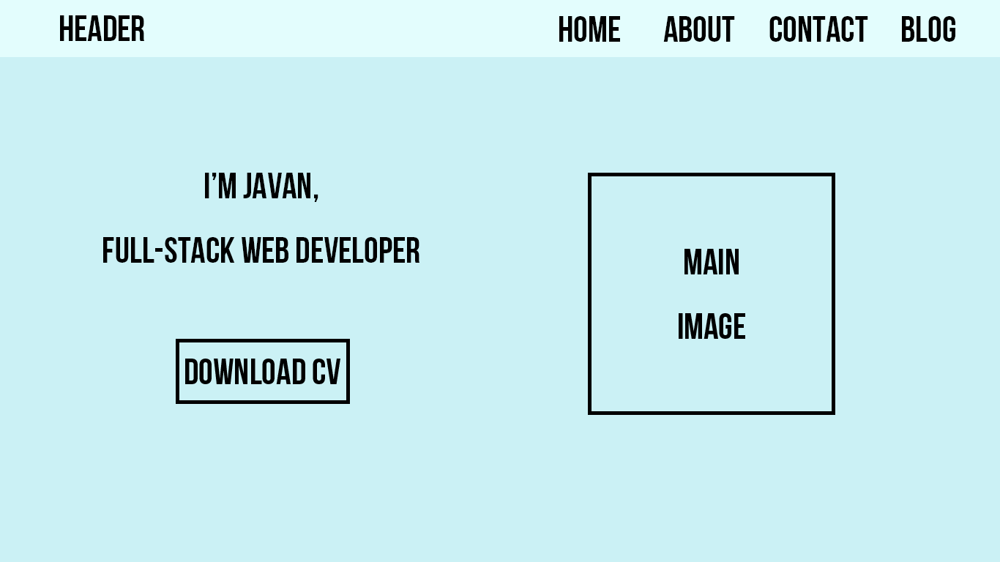
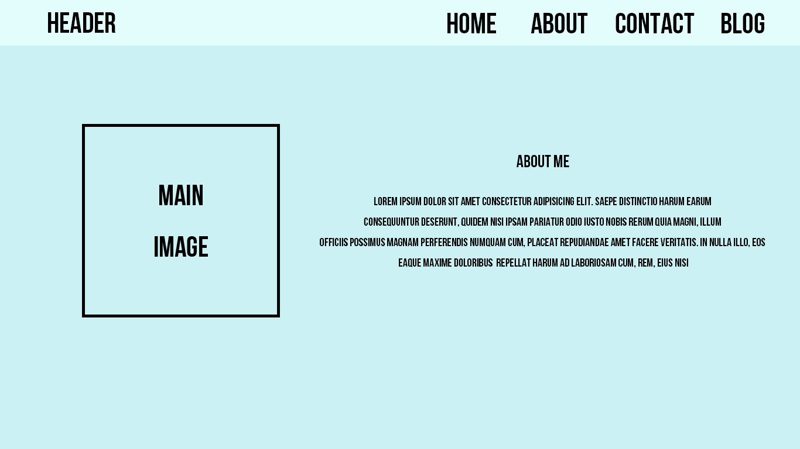
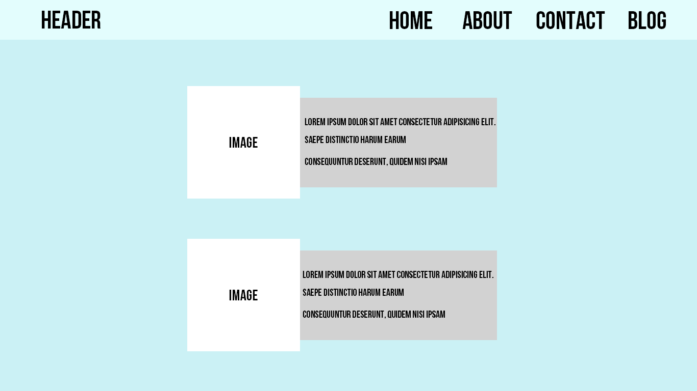

 
 

### Tablet Mockups
 

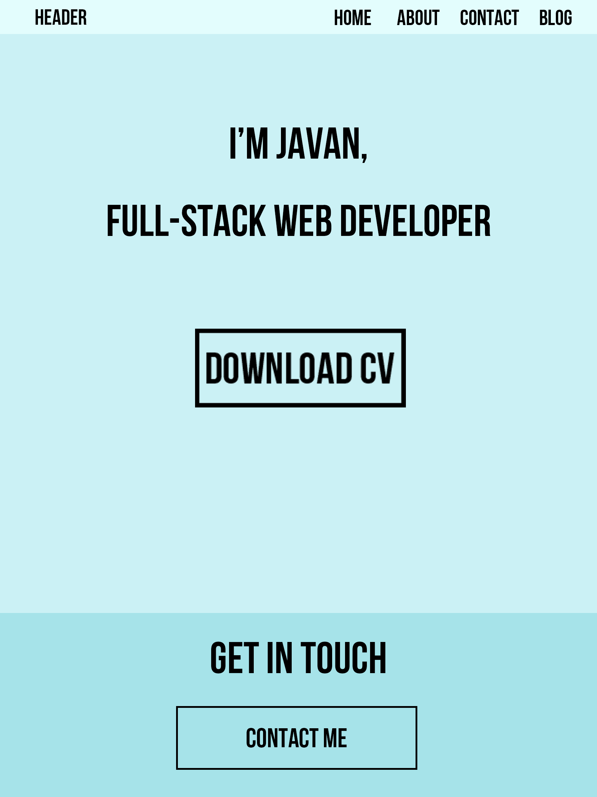
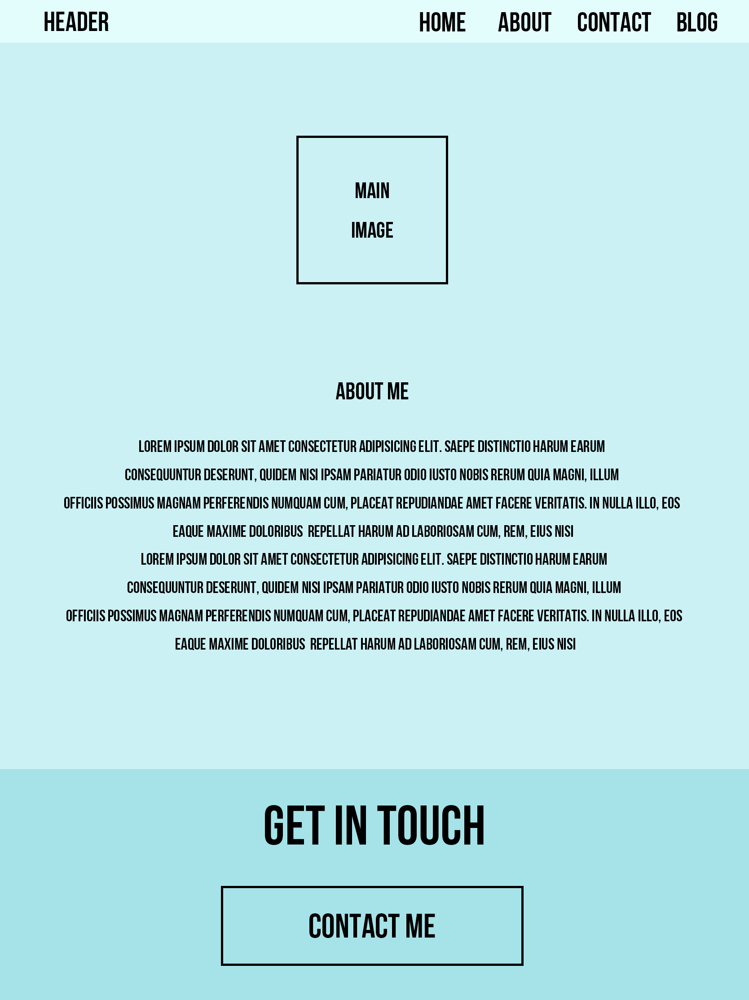
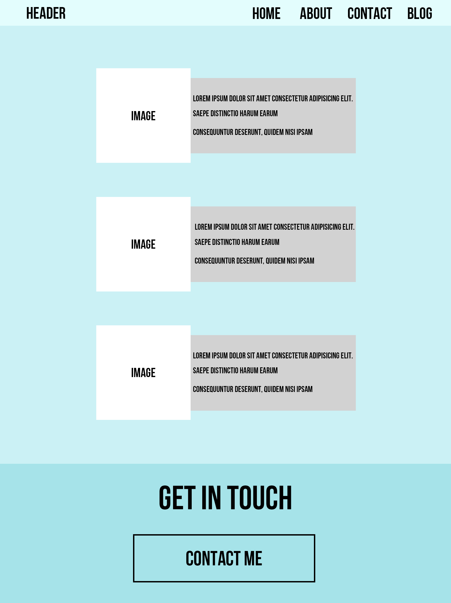
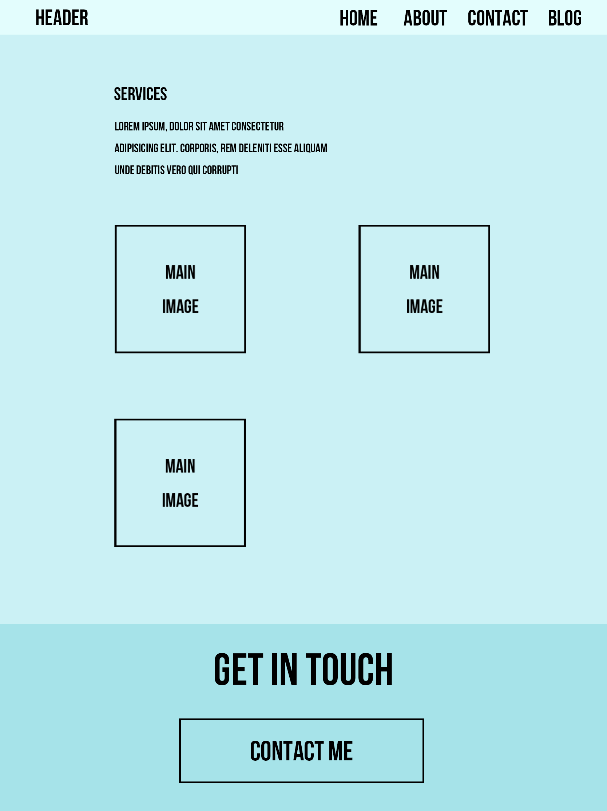
 
 

### Mobile Mockups
 

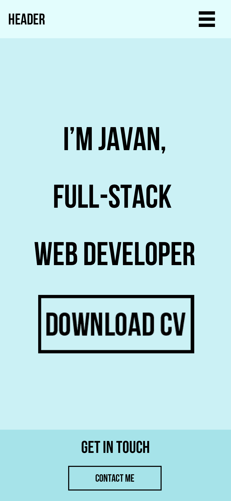
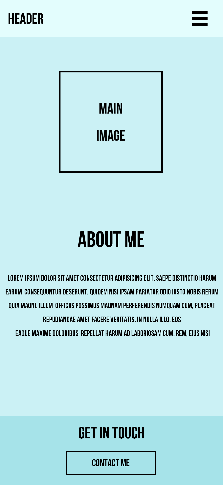
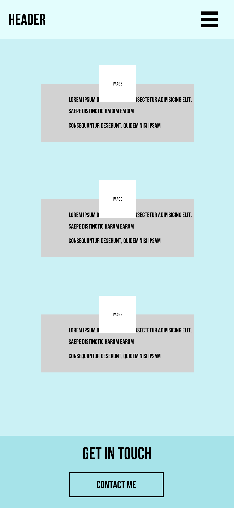
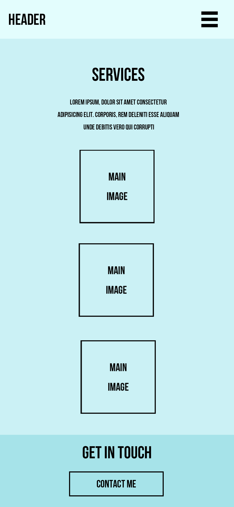
 
 

## Target Audience
The target audience for my portfolio, would include employers seeking web developers, and other developers within the tech community. Due to the minimal yet modern design choices I've utilised, I believe my portfolio would attract and be suitable for most, if not all age groups.
 

## Tech Stack
I have used HTML and CSS in the process of developing my portfolio and netlify to deploy my website.